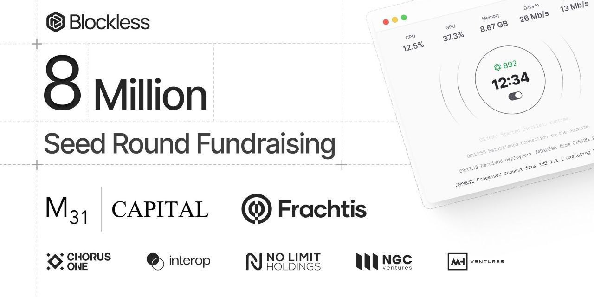

## BLESS NETWORK BOT 



This script automates network or node operations for Blockless Bless Network Bot.

## Register Bless Network

- [Register](https://bless.network/dashboard)

## Features

- **Automated node interaction**

## Installation

1. Clone the repository to your local machine:
   ```bash
   git clone https://github.com/Rambeboy/bless-network-bot.git && cd bless-network-bot
   ```

2. Install the necessary dependencies:
   ```bash
   pip install -r requirements.txt
   ```

4. Run Bot
   ```bash
   python main.py
   ```

## Usage

1. Register to blockless bless network account first, if you dont have you can register [HERE](https://bless.network).
2. Set and Modify `user.txt`. Below how to setup this file, put your B7S_AUTH_TOKEN in the text file, example below:
   ```
   eyJhbGcixxxxxxxxxxxxxxxxxxxxxxxxxxxxxxxxxxxxx
   ```
To get your token, follow this step:
- Login to your grass account in `https://bless.network/dashboard`, make sure you is in this link before go to next step
- Go to inspect element, press F12 or right-click then pick inspect element in your browser
- Go to application tab - look for Local Storage in storage list -> click `https://bless.network` and you will see your B7S_AUTH_TOKEN.
- or you can go Console tab and paste this
  ```bash
  localStorage.getItem('B7S_AUTH_TOKEN').  ```
4. Set and Modify `id.txt`. Below how to setup this file, put your `nodeid(pubkey)` and `hardwareid` in the text file with this format `nodeid(pubkey):hardwareid`, example below:
   ```
   12D3Koxxxxxxxxxxxxxxx:e938610xxxxxxxxxxxx
   ```
To get your token, follow this step:
- Download the [extension](https://chromewebstore.google.com/detail/bless/pljbjcehnhcnofmkdbjolghdcjnmekia)
- After you download the extension, open `chrome://extensions/?id=pljbjcehnhcnofmkdbjolghdcjnmekia`
- Enable `Developer mode` in top right, then press `service worker`. You will see new tab open.


- Go to `network` tab, then open the `Bless extension` and login to your account.
- After you login to your account, search name with your pubkey (example : `12D3xxxx`), open and copy the `pubkey` and `hardwareid`


4. Run the script:
   ```bash
   python main.py
   ```

## Note

The total time is refreshed every 10minute connection.
One account only can have 5 nodeid max and can't be deleted, I recomended to save your Nodeid(pubkey) and hardwareid of your account


## License

This project is licensed under the MIT License - see the [LICENSE](LICENSE) file for details.
